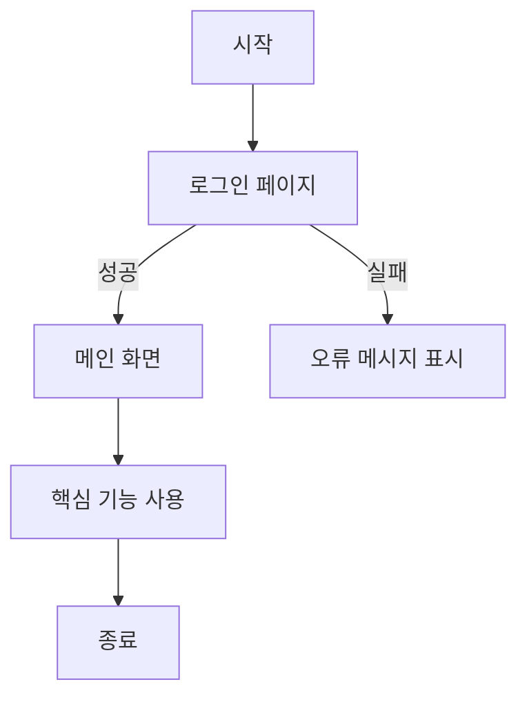
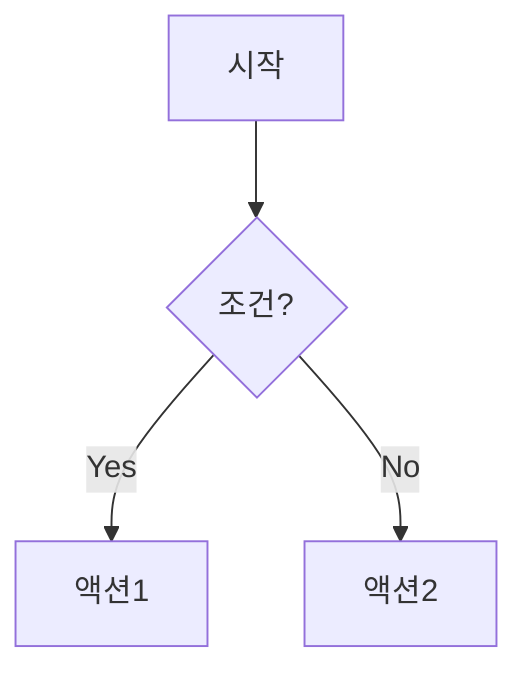

🔄 Flow Chart







## 개요
이 문서는 [프로젝트명]의 주요 프로세스와 시스템 흐름을 시각화하여 정의합니다. 각 기능의 작동 방식과 시스템 내 데이터 흐름을 이해하기 위한 차트를 제공합니다.

## 시스템 전체 흐름도

```
[시스템 전체 흐름도를 나타내는 다이어그램을 여기에 추가]
```

## 주요 프로세스 플로우 차트

### 회원가입 프로세스

```
시작
 |
 ↓
[회원가입 페이지 접속]
 |
 ↓
[사용자 정보 입력]
 |
 ↓
<유효성 검사>
 |
 ├── 실패 → [오류 메시지 표시] → [사용자 정보 수정]
 |
 ↓ 성공
[이메일 인증 코드 발송]
 |
 ↓
[인증 코드 입력]
 |
 ↓
<인증 확인>
 |
 ├── 실패 → [오류 메시지 표시] → [인증 코드 재입력]
 |
 ↓ 성공
[회원가입 완료]
 |
 ↓
[메인 페이지로 이동]
 |
 ↓
종료
```

### 로그인 프로세스

```
시작
 |
 ↓
[로그인 페이지 접속]
 |
 ↓
[아이디/비밀번호 입력]
 |
 ↓
<로그인 인증>
 |
 ├── 실패 → [오류 메시지 표시] → [아이디/비밀번호 재입력]
 |
 ↓ 성공
[사용자 세션 생성]
 |
 ↓
[이전 페이지 또는 메인 페이지로 이동]
 |
 ↓
종료
```

### 콘텐츠 등록 프로세스

```
[콘텐츠 등록 프로세스를 나타내는 다이어그램을 여기에 추가]
```

### 결제 프로세스

```
[결제 프로세스를 나타내는 다이어그램을 여기에 추가]
```

## 데이터 흐름도

### 사용자 데이터 흐름

```
[사용자 데이터 흐름을 나타내는 다이어그램을 여기에 추가]
```

### 콘텐츠 데이터 흐름

```
[콘텐츠 데이터 흐름을 나타내는 다이어그램을 여기에 추가]
```

## 의사결정 트리

### 사용자 권한 결정 흐름

```
[사용자 권한 결정 흐름을 나타내는 다이어그램을 여기에 추가]
```

### 콘텐츠 노출 결정 흐름

```
[콘텐츠 노출 결정 흐름을 나타내는 다이어그램을 여기에 추가]
```

## 오류 처리 흐름

### 네트워크 오류 처리

```
[네트워크 오류 처리 흐름을 나타내는 다이어그램을 여기에 추가]
```

### 입력 오류 처리

```
[입력 오류 처리 흐름을 나타내는 다이어그램을 여기에 추가]
```

## 참고사항
- 플로우 차트는 개발 단계에서 상세화될 수 있습니다.
- 실제 구현 시 예외 케이스가 추가될 수 있습니다.
- 이 문서의 다이어그램은 [사용한 도구명]을 사용하여 작성되었습니다.


   ----------------------------------------------------------------  
## 목차

#### [1. 문서 히스토리](1.Document_History)
#### 2. IT 기획
- [[2-1.Menu_Structure|2-1. 메뉴 구조]]
- [[2-2.Task_Flow|2-2. 유저 시나리오]]
- [[2-3.Information_Architecture|2-3. 정보 구조도]]
- [[2-4.WireFrame|2-4. 와이어프레임]]
- [[2-5.Screen_Description|2-5. 화면 정의서]]
 - [[2-6.Flow_Chart|2-6. 플로우차트]]
- [[2-7.User_Flow|2-7. 유저플로우]]
- [[2-8.Functional_Specification|2-8. 기능 명세서]]
#### 3. 정책(Policy)
- [[3-1.Service_Use_Policy|3.1 서비스 이용 정책]]
- [[3-2.State_Value|3-2. 상태값]]
- [[3-3.Membership_System|3-3. 회원 체계]]
- [[3-4.CRUD|3-4. 페이지 별 CRUD]]
- [[3-5.Grade_Scoring_Policy|3-5. 등급 및 점수 정책]]

